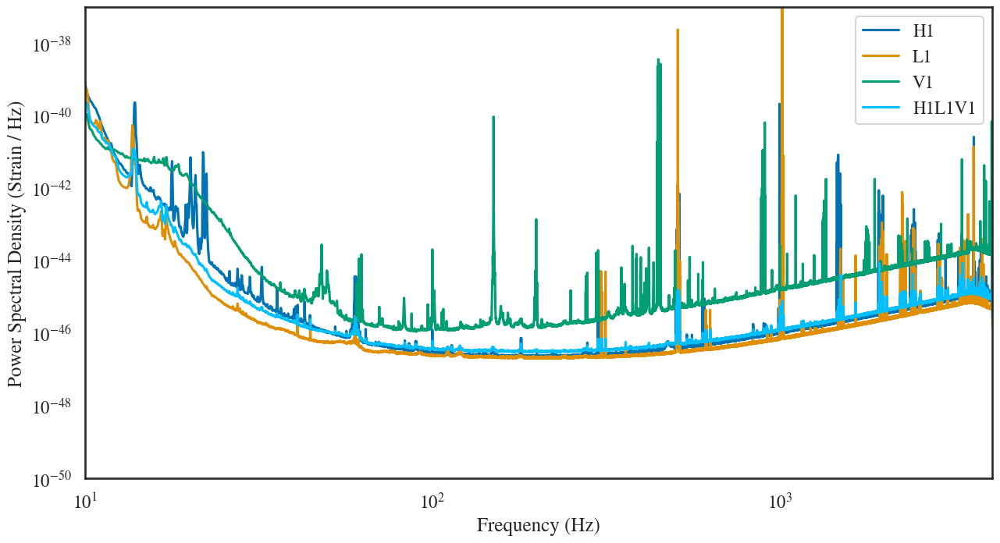

#  O3 24 Nov. '19  average noise PSD estimates

Average single-detector and multi-detector noise PSDs from the November 24 O3 data
using C01 calibration. The averaging uses the harmonic mean.

To generate the workflow, copy the `submit.sh` file in your local directory and run `bash submit.sh user.name`. Depending upon your choice please change the `GPSSTART` and `GPSEND`. The estimation is made on C01 data `data_O3_C01.ini`.

When the above command completes successfully, submit the workflow:
```
cd output
pycbc_submit_dax --dax ${WORKFLOW_NAME}.dax --accounting-group ligo.prod.o3.cbc.nsbh.pycbcoffline --no-grid
```

Wait for completion, then get the average PSDs and plots from the `output/psds`
and `output/plots` directories.

See the [general PyCBC documentation](http://ligo-cbc.github.io/pycbc/latest/html/workflow/pycbc_make_psd_estimation_workflow.html)
to understand the content of `psd_estimation.ini`.



See the DetChar [Summary Page](https://ldas-jobs.ligo.caltech.edu/~detchar/summary/day/20191124/) for details.

The files committed here can be found in the following location in the **CIT** cluster:
```
/home/koustav.chandra/o3_dev_ops/psds
```