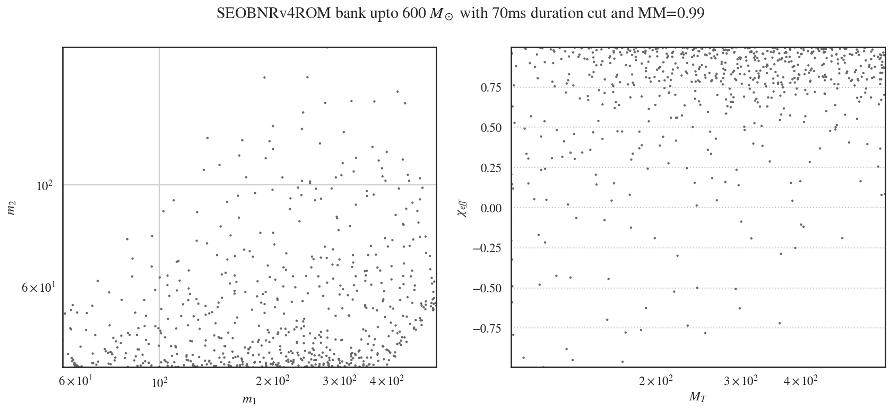

# O3 IMBHB template bank
Template bank for the PyCBC search on O3 24 Nov'19 C01 data and configuration file for its construction.

## Bank design

| Parameters | Values |
| ----- | ----- |
| spin range |  |
| Total Mass |  |
| Mass-Ratio |  |
| f-low |  |
| Minimum Match | 0.99 | 
| Minimum template duration | 70ms |
| Total number of templates | 630 |

## Building the bank

To setup the workflow, run `bash submit.sh user.name`. 
When the above command completes successfully, submit the workflow by:
```
cd output
pycbc_submit_dax --dax ${WORKFLOW_NAME}.dax --accounting-group ligo.dev.o3.cbc.bbh.pycbcoffline --no-grid
```
Wait for completion, then get the bank inside the `output` directory



See the general [PyCBC documentation](https://pycbc.org/pycbc/latest/html/tmpltbank.html) to understand the content of `tmpltbank_600.ini`.
